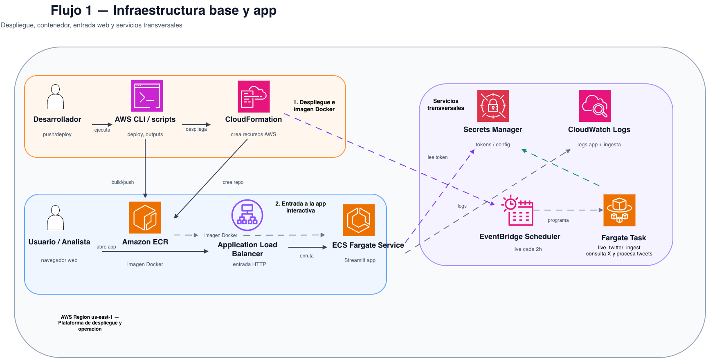
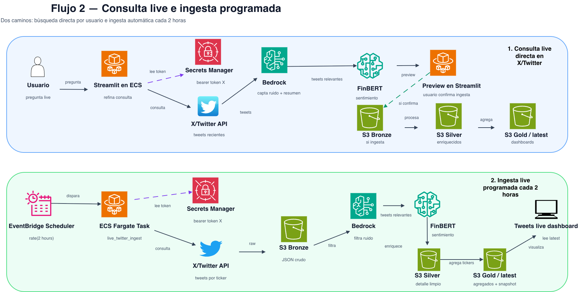
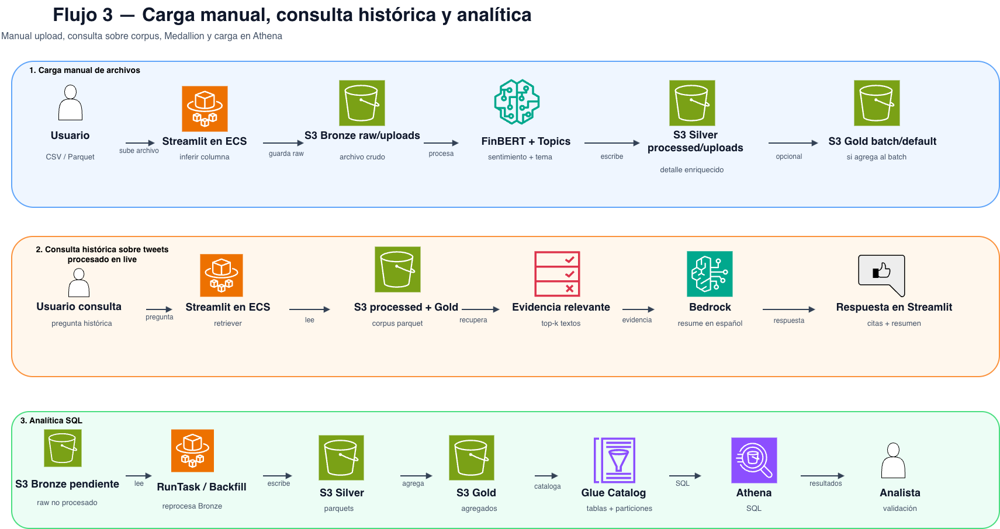

# Financial Sentiment Radar AWS

Producto de datos para monitorear sentimiento financiero en X/Twitter y archivos cargados manualmente, priorizar compañías o temas con señales de riesgo de mercado/reputación, consultar evidencia textual y publicar datasets procesados en una arquitectura tipo Medallion sobre S3.

El proyecto combina una aplicación Streamlit, ingesta programada en ECS Fargate, búsqueda live en X, clasificación de sentimiento con FinBERT, etiquetado de ruido y resumen con Amazon Bedrock, almacenamiento en S3 y tablas consultables por Athena/Glue.

---

## Tabla de contenidos

1. [Objetivo del proyecto](#objetivo-del-proyecto)
2. [Qué problema resuelve](#qué-problema-resuelve)
3. [Arquitectura funcional](#arquitectura-funcional)
4. [Secciones de la aplicación](#secciones-de-la-aplicación)
5. [Entradas y salidas](#entradas-y-salidas)
6. [Estructura del repositorio](#estructura-del-repositorio)
7. [Componentes principales del código](#componentes-principales-del-código)
8. [Instalación local](#instalación-local)
9. [Variables de entorno](#variables-de-entorno)
10. [Ejecución local](#ejecución-local)
11. [Pruebas, linting y formato](#pruebas-linting-y-formato)
12. [Docker](#docker)
13. [Despliegue en AWS](#despliegue-en-aws)
14. [Ingesta live programada](#ingesta-live-programada)
15. [Búsqueda live manual con Bedrock](#búsqueda-live-manual-con-bedrock)
16. [Medallion: Bronze, Silver y Gold](#medallion-bronze-silver-y-gold)
17. [Reprocesamiento y backfills](#reprocesamiento-y-backfills)
18. [Athena y Glue Catalog](#athena-y-glue-catalog)
19. [Monitoreo y validación operativa](#monitoreo-y-validación-operativa)
20. [Seguridad y costos](#seguridad-y-costos)
21. [Documentos importantes](#documentos-importantes)
22. [Referencias](#referencias)
23. [Licencia](#licencia)

---

## Objetivo del proyecto

**Financial Sentiment Radar AWS** busca convertir tweets financieros, consultas live y archivos cargados manualmente en un producto de datos operativo. El objetivo no es solo clasificar sentimiento, sino construir un flujo completo de datos que permita:

- Buscar señales financieras recientes en X/Twitter.
- Filtrar ruido con Bedrock y reglas financieras.
- Clasificar sentimiento financiero con FinBERT.
- Identificar tickers, temas y riesgos.
- Guardar datos crudos, procesados y agregados en S3.
- Consultar resultados desde Streamlit, Athena o datasets Parquet.
- Mantener una ingesta automática cada 2 horas para alimentar dashboards live.

El producto está pensado como un MVP de monitoreo financiero y reputacional para equipos de data, riesgo, research, analítica o producto.

---

## Demo pública desplegada

Aplicación Streamlit desplegada en AWS ECS Fargate:

http://financ-LoadB-LkstQiVdgd08-2040320807.us-east-1.elb.amazonaws.com

---

## Qué problema resuelve

Las redes sociales contienen señales útiles para mercados financieros, reputación corporativa y eventos macroeconómicos, pero también contienen mucho ruido: memes, política no financiera, spam, posts virales sin relación con inversión, duplicados o lenguaje ambiguo.

Este proyecto reduce ese ruido usando una arquitectura en capas:

1. **Búsqueda controlada en X/Twitter** mediante queries financieras.
2. **Ranking local** por interacción, fuente curada y relevancia financiera.
3. **Filtro de anclas fuertes** para preservar entidades clave de la consulta, por ejemplo `Moody + Mexico + rating`.
4. **Bedrock** para ruido/no ruido, resumen y traducción selectiva.
5. **FinBERT** para sentimiento financiero.
6. **Reglas determinísticas** para casos donde FinBERT en inglés puede fallar con texto financiero en español.
7. **Medallion en S3** para que los datos puedan reutilizarse en Athena, dashboards o procesos batch.

---

## Arquitectura funcional

La siguiente figura resume el flujo principal de despliegue, operación e ingesta live del producto sobre AWS:



A continuación se muestra además el flujo específico de consulta live e ingesta programada desde X/Twitter hacia las capas Bronze, Silver y Gold en S3:



Por último, la figura a continuación resume el flujo de carga manual de archivos, consulta histórica sobre el corpus procesado y analítica SQL mediante Athena:



```text
Usuario / Scheduler
      |
      |-- Consulta manual en Streamlit
      |      |
      |      |-- refine_live_question_for_x()
      |      |-- build_precise_anchor_query()
      |      |-- X Recent Search API
      |      |-- ranking local por engagement/fuente/relevancia
      |      |-- filtro de anclas fuertes
      |      |-- Bedrock: ruido/no ruido + resumen
      |      |-- traducción selectiva a inglés financiero
      |      |-- FinBERT: sentimiento
      |      |-- preview en Streamlit
      |      |-- ingesta confirmada por usuario a S3
      |
      |-- Ingesta automática cada 2 horas
      |      |
      |      |-- EventBridge Scheduler
      |      |-- ECS Fargate task
      |      |-- X Recent Search API por ticker
      |      |-- Bronze JSON
      |      |-- Bedrock relevance / fallback heurístico
      |      |-- FinBERT
      |      |-- Silver Parquet
      |      |-- Gold agregados
      |      |-- gold/twitter_live/latest.parquet
      |
      |-- Carga manual CSV/Parquet
             |
             |-- inferencia de columna de texto
             |-- procesamiento batch
             |-- processed/tweets/financial_sentiment_latest.parquet
             |-- dashboards batch
```

Servicios AWS usados:

- **Amazon S3**: almacenamiento de datos raw, processed, bronze, silver y gold.
- **Amazon ECS on Fargate**: ejecución de la app Streamlit y jobs de ingesta.
- **Amazon ECR**: registro de imágenes Docker.
- **Application Load Balancer**: exposición pública de la app Streamlit.
- **AWS Secrets Manager**: almacenamiento del bearer token de X/Twitter.
- **Amazon Bedrock**: filtro de ruido, resumen y traducción selectiva.
- **Amazon EventBridge Scheduler**: ingesta automática cada 2 horas.
- **AWS Glue Data Catalog / Athena**: catálogo y consulta SQL de capas Silver/Gold.
- **CloudWatch Logs**: diagnóstico de la app y jobs programados.

---

## Secciones de la aplicación

La aplicación principal está en:

```text
app/streamlit_app.py
```

Y se apoya en componentes de UI definidos en:

```text
src/financial_sentiment/streamlit_live_tab.py
```

### 1. Resumen

Muestra KPIs generales del batch activo:

- Textos procesados.
- Menciones mapeadas a tickers.
- Ratio positivo.
- Ratio neutral.
- Ratio negativo.
- Ranking de tickers.
- Tendencia temporal de sentimiento.

### 2. Consultas

Contiene dos funciones:

**Búsqueda live en X/Twitter con Bedrock**

- El usuario escribe una consulta natural, por ejemplo:
  - `Mexico Moody credit rating Baa3`
  - `Google antitrust DOJ`
  - `Banxico tasa inflación`
  - `Nvidia earnings guidance`
- El sistema refina la consulta sin borrar entidades fuertes.
- Si hay anclas fuertes, construye una query precisa y de bajo costo.
- Trae candidatos desde X.
- Rankea por interacción, cuenta curada y relevancia financiera.
- Filtra ruido con Bedrock.
- Traduce selectivamente textos financieros no ingleses antes de FinBERT.
- Clasifica sentimiento con FinBERT.
- Muestra preview antes de ingestar.
- El usuario decide si ingestar los tweets relevantes a S3.

**Consulta sobre batch + tweets live ya ingeridos**

- Busca evidencia en el corpus ya procesado.
- Usa recuperación local sobre tweets batch + live.
- Usa Bedrock para resumir en español cuando está disponible.
- Tiene fallback extractivo local si Bedrock falla.

### 3. Temas/Riesgo

Muestra concentración negativa y positiva por tema. Los topics se clasifican con reglas en:

```text
src/financial_sentiment/topics.py
```

Taxonomía principal:

```text
sovereign_credit_rating
monetary_policy
fx_rates
geopolitical_risk
regulation_antitrust
commodities_energy
credit_risk
banking_sector
labor_market
analyst_rating
earnings
market_action
ai_chips
product_launch
risk_compliance
general_market
```

### 4. Tweets live

Lee:

```text
gold/twitter_live/latest.parquet
```

Muestra:

- Tweets live ingeridos.
- Ratios por sentimiento.
- Ranking live de tickers.
- Tendencia temporal.
- Tabla descargable de tweets capturados.

### 5. Datos batch

Antes llamada `Datos procesados`; muestra el dataset batch activo cargado manualmente o generado por default.

Permite:

- Filtrar por ticker.
- Revisar textos procesados.
- Revisar columnas finales.
- Descargar datos batch.

---

## Entradas y salidas

### Entradas

1. **Archivos manuales**

Formatos:

```text
.csv
.parquet
```

Columnas esperadas o inferibles:

```text
text
input
tweet
content
body
message
clean_text
```

La app intenta inferir cuál columna contiene texto mediante reglas en:

```text
src/financial_sentiment/schema_inference.py
```

2. **X/Twitter Recent Search API**

Usada por:

```text
src/financial_sentiment/x_api_client.py
src/financial_sentiment/live_search_service.py
src/financial_sentiment/jobs/live_twitter_ingest.py
```

3. **Secrets Manager**

Se usa para recuperar el bearer token de X/Twitter:

```text
financial-sentiment-radar/twitter-bearer
```

4. **Bedrock**

Modelo recomendado:

```text
us.anthropic.claude-haiku-4-5-20251001-v1:0
```

Se usa para:

- Ruido/no ruido.
- Resumen en español.
- Traducción selectiva de textos financieros en español/otros idiomas.

### Salidas

1. **Batch processed**

```text
s3://<APP_BUCKET>/processed/tweets/financial_sentiment_latest.parquet
```

2. **Bronze live**

Raw JSON de X:

```text
s3://<APP_BUCKET>/bronze/twitter_live/ingestion_date=YYYY-MM-DD/<run_id>.json
```

3. **Silver live**

Tweets normalizados y enriquecidos:

```text
s3://<APP_BUCKET>/silver/tweets/source=twitter_live/ingestion_date=YYYY-MM-DD/<run_id>.parquet
```

4. **Gold live**

Agregado diario por ticker/sentimiento:

```text
s3://<APP_BUCKET>/gold/sentiment_by_ticker_daily/source=twitter_live/ingestion_date=YYYY-MM-DD/<run_id>.parquet
```

5. **Latest live para Streamlit**

```text
s3://<APP_BUCKET>/gold/twitter_live/latest.parquet
```

---

## Estructura del repositorio

```text
financial_sentiment_radar_aws/
├── app/
│   └── streamlit_app.py
│
├── src/
│   └── financial_sentiment/
│       ├── __init__.py
│       ├── analytics.py
│       ├── additive_refinements.py
│       ├── bedrock.py
│       ├── charts.py
│       ├── config.py
│       ├── live_query_catalog.py
│       ├── live_ranking.py
│       ├── live_relevance.py
│       ├── live_search_service.py
│       ├── medallion.py
│       ├── multilingual_finbert.py
│       ├── pipeline.py
│       ├── query_anchor_filter.py
│       ├── retrieval.py
│       ├── schema_inference.py
│       ├── spanish_financial_overrides.py
│       ├── storage.py
│       ├── streamlit_live_tab.py
│       ├── topics.py
│       ├── x_api_client.py
│       └── jobs/
│           ├── __init__.py
│           ├── batch_process.py
│           └── live_twitter_ingest.py
│
├── infra/
│   └── cloudformation/
│       ├── 01_fargate_streamlit.yml
│       └── 02_live_ingestion_athena.yml
│
├── scripts/
│   ├── 06_build_push_app.sh
│   ├── 07_deploy_ecs.sh
│   ├── 09_print_outputs.sh
│   ├── 11_deploy_live_ingestion_athena.sh
│   ├── 12_create_aws_budget_100.sh
│   ├── 13_backfill_twitter_live_from_bronze.py
│   └── 14_reprocess_topics_and_spanish_overrides.py
│
├── sql/
│   └── final_consultas_live_queries.sql
│
├── docs/
│   ├── README_FINAL_CONSULTAS_LIVE_SEARCH.md
│   ├── README_FINAL_PHASE_CONSULTAS_PREVIEW_FIX.md
│   ├── README_FINAL_STABILITY_PATCH.md
│   └── README_FINAL_ADDITIVE_REFINEMENTS.md
│
├── tests/
│   ├── test_additive_refinements.py
│   ├── test_final_consultas_query_catalog.py
│   ├── test_final_live_query.py
│   ├── test_final_live_search_limits.py
│   ├── test_final_phase_live_query_fix.py
│   ├── test_live_relevance.py
│   └── test_topics_expanded.py
│
├── Dockerfile
├── requirements.txt
├── requirements.docker.txt
├── pyproject.toml
├── uv.lock
└── README.md
```

---

## Componentes principales del código

### `app/streamlit_app.py`

Punto de entrada de la app Streamlit. Coordina:

- Layout principal.
- Carga de configuración.
- Upload de CSV/Parquet.
- Procesamiento batch.
- Tabs de resumen, consultas, temas, tweets live y datos batch.

### `src/financial_sentiment/config.py`

Carga configuración desde variables de entorno. Define parámetros como:

- Bucket S3.
- Backend local/S3.
- Modelo Bedrock.
- Flags de Bedrock.
- Configuración de FinBERT.
- Secret de X/Twitter.

### `src/financial_sentiment/pipeline.py`

Pipeline principal de procesamiento:

```text
raw dataframe
→ limpieza / canonicalización
→ detección de ticker
→ sentimiento
→ topics
→ dataframe procesado
```

### `src/financial_sentiment/topics.py`

Clasificación determinística de temas financieros. Tiene una taxonomía extendida para:

- Calificación soberana.
- Política monetaria.
- Tipo de cambio.
- Riesgo geopolítico.
- Regulación/antitrust.
- Energía/commodities.
- Riesgo de crédito.
- Sector bancario.
- Earnings.
- Mercado.
- IA/chips.

### `src/financial_sentiment/live_query_catalog.py`

Catálogo de empresas, cuentas curadas y queries base para ingesta live. Contiene:

- Cuentas financieras confiables.
- Tickers monitoreados.
- Alias de empresas.
- Queries por ticker.
- Fallbacks para búsqueda amplia.

### `src/financial_sentiment/additive_refinements.py`

Refinamiento determinístico de preguntas del usuario. Convierte preguntas naturales en búsquedas más financieras sin borrar anclas fuertes.

Ejemplos:

```text
Qué se dice de México
→ México + Banxico + peso + inflación + tasas + mercado

Mexico Moody
→ se conserva como Mexico Moody porque tiene anclas fuertes
```

### `src/financial_sentiment/query_anchor_filter.py`

Filtro de anclas fuertes. Evita que una consulta con entidades específicas devuelva tweets genéricos.

Ejemplo:

```text
Mexico Moody
```

requiere candidatos que preserven:

```text
Mexico/México + Moody + rating/calificación/downgrade/Baa3
```

Esto evita que la app responda con tweets de Banxico/tasas cuando el usuario preguntó por Moody.

### `src/financial_sentiment/live_ranking.py`

Ranking local de candidatos de X. Combina:

- Interacción pública.
- Fuente curada.
- Relevancia financiera.
- Penalización de ruido.

El ranking ayuda, pero no permite que un tweet viral no financiero domine la respuesta.

### `src/financial_sentiment/live_relevance.py`

Filtro ruido/no ruido con Bedrock y fallback heurístico. Tiene parser tolerante para respuestas JSON de Bedrock aunque vengan con markdown, texto alrededor o estructuras parcialmente diferentes.

### `src/financial_sentiment/multilingual_finbert.py`

Wrapper que permite traducción selectiva antes de FinBERT:

```text
Texto en inglés
→ FinBERT directo

Texto financiero en español/otro idioma
→ Bedrock traduce a inglés financiero breve
→ FinBERT clasifica la traducción
→ se conserva texto original
```

Guarda columnas de auditoría:

```text
original_text
finbert_input_text
translation_model
translation_reason
```

### `src/financial_sentiment/spanish_financial_overrides.py`

Overrides determinísticos para casos financieros claros en español, por ejemplo:

```text
Moody’s recorta calificación de México
→ topic = sovereign_credit_rating
→ sentiment = negative
```

### `src/financial_sentiment/x_api_client.py`

Cliente para X/Twitter Recent Search API. Construye requests, normaliza respuestas y extrae campos útiles.

### `src/financial_sentiment/medallion.py`

Funciones para escribir JSON/Parquet en S3 bajo estructura Bronze/Silver/Gold.

### `src/financial_sentiment/jobs/live_twitter_ingest.py`

Job ejecutado por ECS Fargate para ingesta automática. Hace:

```text
X search por ticker
→ Bronze JSON
→ Bedrock relevance
→ FinBERT
→ Silver Parquet
→ Gold agregados
→ latest.parquet
```

### `src/financial_sentiment/jobs/batch_process.py`

Job para procesamiento batch por CLI.

### `scripts/13_backfill_twitter_live_from_bronze.py`

Reprocesa objetos de Bronze que no llegaron a Silver/Gold debido a errores anteriores.

### `scripts/14_reprocess_topics_and_spanish_overrides.py`

Reprocesa topics y overrides sobre parquets ya existentes sin volver a consultar X.

---

## Instalación local

### Requisitos

- Python 3.12.
- uv.
- Docker.
- AWS CLI configurado.
- Credenciales AWS con permisos para S3, ECS, ECR, CloudFormation, Secrets Manager, Bedrock y CloudWatch Logs.
- Bearer token de X/Twitter guardado en Secrets Manager.

Instalar dependencias:

```bash
uv sync --all-groups
```

Activar entorno opcionalmente:

```bash
source .venv/bin/activate
```

---

## Variables de entorno

Variables principales:

```bash
export AWS_REGION=us-east-1
export DATA_BACKEND=s3
export APP_BUCKET=financial-sentiment-radar-dev-foundatio-databucket-coafx0g9hqds
export S3_BUCKET="$APP_BUCKET"
export DATA_BUCKET="$APP_BUCKET"
```

Bedrock:

```bash
export USE_BEDROCK=true
export USE_BEDROCK_SCHEMA=true
export USE_BEDROCK_RELEVANCE=true
export USE_BEDROCK_TRANSLATION=true
export BEDROCK_MODEL_ID=us.anthropic.claude-haiku-4-5-20251001-v1:0
export BEDROCK_TRANSLATION_MODEL_ID=us.anthropic.claude-haiku-4-5-20251001-v1:0
export BEDROCK_TRANSLATION_MAX_ROWS=25
```

FinBERT:

```bash
export SENTIMENT_MODEL=finbert
export FINBERT_MODEL_NAME=ProsusAI/finbert
export FINBERT_BATCH_SIZE=16
```

X/Twitter:

```bash
export TWITTER_BEARER_SECRET_ARN=$(aws secretsmanager describe-secret \
  --region us-east-1 \
  --secret-id financial-sentiment-radar/twitter-bearer \
  --query ARN \
  --output text)
```

Para pruebas locales directas:

```bash
export TWITTER_BEARER=$(aws secretsmanager get-secret-value \
  --region us-east-1 \
  --secret-id financial-sentiment-radar/twitter-bearer \
  --query SecretString \
  --output text)
```

---

## Ejecución local

```bash
PYTHONPATH=src uv run streamlit run app/streamlit_app.py
```

Si se quiere probar solo el pipeline de búsqueda live sin ingestar a S3:

```bash
PYTHONPATH=src \
USE_BEDROCK_RELEVANCE=true \
USE_BEDROCK_TRANSLATION=true \
BEDROCK_MODEL_ID=us.anthropic.claude-haiku-4-5-20251001-v1:0 \
BEDROCK_TRANSLATION_MODEL_ID=us.anthropic.claude-haiku-4-5-20251001-v1:0 \
AWS_REGION=us-east-1 \
uv run python - <<'PY'
import os
from financial_sentiment.live_search_service import preview_direct_live_search

preview = preview_direct_live_search(
    user_query="Mexico Moody credit rating Baa3",
    bearer_token=os.environ["TWITTER_BEARER"],
    region_name="us-east-1",
    max_results=5,
    sentiment_model="finbert",
    finbert_model_name="ProsusAI/finbert",
    finbert_batch_size=16,
    use_bedrock=True,
    bedrock_model_id=os.environ["BEDROCK_MODEL_ID"],
    language="auto",
    sort_order="relevancy",
    search_scope="broad_all_x",
)

print("rows_requested:", preview.rows_requested)
print("rows_raw:", preview.rows_raw)
print("rows_relevant:", preview.rows_relevant)
print("warning:", preview.warning)
print("query:\n", preview.query)
print(preview.summary)
PY
```

---

## Pruebas, linting y formato

Ejecutar todas las pruebas:

```bash
PYTHONPATH=src uv run pytest -q
```

Aplicar ruff autofix:

```bash
uv run ruff check . --fix
```

Formatear:

```bash
uv run ruff format .
```

Validación final:

```bash
uv run ruff check .
```

Comando completo recomendado antes de commit:

```bash
PYTHONPATH=src uv run pytest -q
uv run ruff check . --fix
uv run ruff format .
uv run ruff check .
```

---

## Docker

El proyecto usa dos archivos de dependencias:

```text
requirements.txt          # entorno general/local
requirements.docker.txt   # Docker/Fargate con torch CPU-only
```

La imagen Docker usa PyTorch CPU-only para evitar dependencias CUDA/NVIDIA en Fargate.

Construir y subir a ECR:

```bash
./scripts/06_build_push_app.sh
```

Validar dentro de Docker:

```bash
docker run --rm \
  --platform linux/amd64 \
  --entrypoint python \
  financial-sentiment-radar:debug \
  -c "import torch; print(torch.__version__)"
```

Debe mostrar una versión CPU compatible, por ejemplo:

```text
2.6.0+cpu
```

---

## Despliegue en AWS

### App Streamlit en ECS Fargate

```bash
source config/generated.env

export DATA_BACKEND=s3
export APP_BUCKET=financial-sentiment-radar-dev-foundatio-databucket-coafx0g9hqds
export S3_BUCKET="$APP_BUCKET"
export DATA_BUCKET="$APP_BUCKET"

export TWITTER_BEARER_SECRET_ARN=$(aws secretsmanager describe-secret \
  --region us-east-1 \
  --secret-id financial-sentiment-radar/twitter-bearer \
  --query ARN \
  --output text)

export SENTIMENT_MODEL=finbert
export FINBERT_MODEL_NAME=ProsusAI/finbert
export FINBERT_BATCH_SIZE=16

export USE_BEDROCK=true
export USE_BEDROCK_SCHEMA=true
export USE_BEDROCK_RELEVANCE=true
export USE_BEDROCK_TRANSLATION=true
export BEDROCK_MODEL_ID=us.anthropic.claude-haiku-4-5-20251001-v1:0
export BEDROCK_TRANSLATION_MODEL_ID=us.anthropic.claude-haiku-4-5-20251001-v1:0
export BEDROCK_TRANSLATION_MAX_ROWS=25

export TASK_CPU=1024
export TASK_MEMORY=4096

./scripts/06_build_push_app.sh
./scripts/07_deploy_ecs.sh
./scripts/09_print_outputs.sh
```

Si CloudFormation indica `No changes to deploy` pero la imagen fue actualizada con el mismo tag, forzar nueva task:

```bash
aws ecs update-service \
  --region us-east-1 \
  --cluster financial-sentiment-radar-dev-cluster \
  --service financial-sentiment-radar-dev-service \
  --force-new-deployment

aws ecs wait services-stable \
  --region us-east-1 \
  --cluster financial-sentiment-radar-dev-cluster \
  --services financial-sentiment-radar-dev-service
```

---

## Ingesta live programada

Despliegue de ingesta live + Athena/Glue:

```bash
./scripts/11_deploy_live_ingestion_athena.sh
```

La ingesta programada corre cada 2 horas mediante EventBridge Scheduler y ejecuta una task Fargate.

Validar scheduler:

```bash
aws scheduler get-schedule \
  --region us-east-1 \
  --name financial-sentiment-radar-dev-twitter-live-every-2h \
  --group-name default \
  --output json
```

Validar logs:

```bash
aws logs tail "/ecs/financial-sentiment-radar-dev-live-ingestion" \
  --region us-east-1 \
  --since 12h
```

Ejecución manual de la task:

```bash
export SUBNETS=$(aws ecs describe-services \
  --region us-east-1 \
  --cluster financial-sentiment-radar-dev-cluster \
  --services financial-sentiment-radar-dev-service \
  --query "services[0].networkConfiguration.awsvpcConfiguration.subnets" \
  --output text | tr '\t' ',')

export SG=$(aws ecs describe-services \
  --region us-east-1 \
  --cluster financial-sentiment-radar-dev-cluster \
  --services financial-sentiment-radar-dev-service \
  --query "services[0].networkConfiguration.awsvpcConfiguration.securityGroups[0]" \
  --output text)

TASK_ARN=$(aws ecs run-task \
  --region us-east-1 \
  --cluster financial-sentiment-radar-dev-cluster \
  --launch-type FARGATE \
  --task-definition financial-sentiment-radar-dev-live-ingestion-task \
  --network-configuration "awsvpcConfiguration={subnets=[$SUBNETS],securityGroups=[$SG],assignPublicIp=ENABLED}" \
  --query "tasks[0].taskArn" \
  --output text)

echo "$TASK_ARN"
```

Revisar resultado:

```bash
sleep 180

aws ecs describe-tasks \
  --region us-east-1 \
  --cluster financial-sentiment-radar-dev-cluster \
  --tasks "$TASK_ARN" \
  --query "tasks[0].[lastStatus,stoppedReason,containers[0].exitCode,containers[0].reason]" \
  --output json
```

---

## Búsqueda live manual con Bedrock

La búsqueda manual se controla principalmente por:

```text
src/financial_sentiment/live_search_service.py
src/financial_sentiment/additive_refinements.py
src/financial_sentiment/query_anchor_filter.py
src/financial_sentiment/live_ranking.py
src/financial_sentiment/live_relevance.py
```

Flujo:

1. El usuario escribe una pregunta.
2. El refinador conserva anclas fuertes.
3. Si hay entidades fuertes, se construye una query precisa.
4. X API busca candidatos.
5. El ranking local ordena candidatos.
6. El filtro de anclas elimina candidatos que no respetan entidades clave.
7. Bedrock etiqueta ruido/no ruido.
8. FinBERT clasifica sentimiento.
9. Se muestra preview.
10. El usuario decide si ingestar.

Ejemplos recomendados para validar:

```text
Mexico Moody credit rating Baa3
Google antitrust DOJ
Banxico tasa inflación
Nvidia earnings guidance
oil Middle East risk
```

---

## Medallion: Bronze, Silver y Gold

### Bronze

Contiene respuestas raw de X en JSON.

```text
bronze/twitter_live/ingestion_date=YYYY-MM-DD/<run_id>.json
```

Uso:

- Auditoría.
- Reprocesamiento.
- Diagnóstico cuando falla Silver/Gold.

### Silver

Contiene tweets normalizados y enriquecidos.

```text
silver/tweets/source=twitter_live/ingestion_date=YYYY-MM-DD/<run_id>.parquet
```

Columnas típicas:

```text
tweet_id
created_at
author_username
text
clean_text
query_ticker
primary_ticker
sentiment
sentiment_confidence
topic
is_noise
relevance_score
finbert_input_text
translation_model
translation_reason
```

### Gold

Agregados analíticos por ticker/sentimiento:

```text
gold/sentiment_by_ticker_daily/source=twitter_live/ingestion_date=YYYY-MM-DD/<run_id>.parquet
```

Latest live para la app:

```text
gold/twitter_live/latest.parquet
```

---

## Reprocesamiento y backfills

### Backfill desde Bronze

Si una ingesta llegó a Bronze pero falló antes de Silver/Gold:

```bash
PYTHONPATH=src uv run python scripts/13_backfill_twitter_live_from_bronze.py \
  --bucket "$APP_BUCKET" \
  --start-date 2026-05-22
```

Modo prueba:

```bash
PYTHONPATH=src uv run python scripts/13_backfill_twitter_live_from_bronze.py \
  --bucket "$APP_BUCKET" \
  --start-date 2026-05-22 \
  --dry-run
```

### Reprocesar topics y overrides

```bash
PYTHONPATH=src uv run python scripts/14_reprocess_topics_and_spanish_overrides.py \
  --bucket "$APP_BUCKET"
```

Modo prueba:

```bash
PYTHONPATH=src uv run python scripts/14_reprocess_topics_and_spanish_overrides.py \
  --bucket "$APP_BUCKET" \
  --dry-run
```

---

## Athena y Glue Catalog

La plantilla:

```text
infra/cloudformation/02_live_ingestion_athena.yml
```

crea recursos para Glue/Athena, incluyendo tablas sobre capas Silver y Gold.

Tablas principales:

```text
silver_tweets
gold_sentiment_by_ticker_daily
```

SQL de apoyo:

```text
sql/final_consultas_live_queries.sql
```

Ejemplos de análisis posibles:

- Sentimiento por ticker y día.
- Conteo de tweets por fuente.
- Evolución de sentimiento negativo.
- Topics con mayor concentración negativa.
- Tweets live por `source=twitter_live`.

---

## Monitoreo y validación operativa

### App Streamlit

```bash
aws logs tail "/ecs/financial-sentiment-radar-dev" \
  --region us-east-1 \
  --since 30m
```

### Ingesta live

```bash
aws logs tail "/ecs/financial-sentiment-radar-dev-live-ingestion" \
  --region us-east-1 \
  --since 30m
```

### Ver si latest live se actualizó

```bash
aws s3 ls "s3://$APP_BUCKET/gold/twitter_live/latest.parquet"
```

### Ver últimas escrituras Medallion

```bash
aws s3 ls "s3://$APP_BUCKET/bronze/twitter_live/" --recursive | tail -10
aws s3 ls "s3://$APP_BUCKET/silver/tweets/source=twitter_live/" --recursive | tail -10
aws s3 ls "s3://$APP_BUCKET/gold/sentiment_by_ticker_daily/source=twitter_live/" --recursive | tail -10
aws s3 ls "s3://$APP_BUCKET/gold/twitter_live/" --recursive
```

### Ver deployment ECS

```bash
aws ecs describe-services \
  --region us-east-1 \
  --cluster financial-sentiment-radar-dev-cluster \
  --services financial-sentiment-radar-dev-service \
  --query "services[0].deployments[*].[status,taskDefinition,createdAt,updatedAt,runningCount,desiredCount]" \
  --output table
```

---

## Seguridad y costos

### Seguridad

- No guardar secrets en Git.
- El bearer token de X/Twitter debe vivir en AWS Secrets Manager.
- Las tareas ECS deben usar IAM roles con permisos mínimos.
- Bedrock debe invocarse con modelo permitido por la cuenta.
- No subir archivos `.env`, `.pem`, `.key`, `config/generated.env` ni backups `.bak`.

Revisión antes de commit:

```bash
git status --short | grep -E "generated.env|\.env|\.pem|\.key|\.bak|bak_additive|__pycache__|\.DS_Store"
```

### Costos

El diseño controla costos mediante:

- Ingesta programada limitada a pocos tweets por corrida.
- Búsqueda manual con candidate pool conservador.
- Filtro de anclas antes de Bedrock/FinBERT.
- Traducción selectiva, no traducción de todos los textos.
- Bedrock Haiku para bajo costo/latencia.
- Uso de Fargate con CPU y memoria acotadas.
- PyTorch CPU-only en Docker.

---

## Documentos importantes

Documentos del proyecto:

```text
docs/README_FINAL_CONSULTAS_LIVE_SEARCH.md
```

Explica la fase de búsqueda live y consultas con Bedrock.

```text
docs/README_FINAL_PHASE_CONSULTAS_PREVIEW_FIX.md
```

Explica correcciones sobre preview, ruido y flujo antes de ingestar.

```text
docs/README_FINAL_STABILITY_PATCH.md
```

Notas sobre estabilización de Docker, Torch, Bedrock y ECS.

```text
docs/README_FINAL_ADDITIVE_REFINEMENTS.md
```

Notas sobre refinamientos aditivos: cuentas, tickers, topics y queries.

Scripts operativos:

```text
scripts/06_build_push_app.sh
scripts/07_deploy_ecs.sh
scripts/09_print_outputs.sh
scripts/11_deploy_live_ingestion_athena.sh
scripts/13_backfill_twitter_live_from_bronze.py
scripts/14_reprocess_topics_and_spanish_overrides.py
```

Infraestructura:

```text
infra/cloudformation/01_fargate_streamlit.yml
infra/cloudformation/02_live_ingestion_athena.yml
```

---

## Referencias

- X API Recent Search: https://docs.x.com/x-api/posts/search-recent-posts
- X API Recent Search Quickstart: https://docs.x.com/x-api/posts/search/quickstart/recent-search
- X API Fields / public metrics: https://docs.x.com/x-api/fundamentals/fields
- Amazon Bedrock inference profiles: https://docs.aws.amazon.com/bedrock/latest/userguide/inference-profiles-support.html
- Amazon Bedrock Claude Messages API parameters: https://docs.aws.amazon.com/bedrock/latest/userguide/model-parameters-anthropic-claude-messages-request-response.html
- Claude on Amazon Bedrock: https://platform.claude.com/docs/en/build-with-claude/claude-in-amazon-bedrock
- Streamlit documentation: https://docs.streamlit.io/
- Streamlit CLI run: https://docs.streamlit.io/develop/api-reference/cli/run
- uv documentation: https://docs.astral.sh/uv/
- uv installation: https://docs.astral.sh/uv/getting-started/installation/
- FinBERT model reference: https://huggingface.co/ProsusAI/finbert
- AWS ECS/Fargate documentation: https://docs.aws.amazon.com/AmazonECS/latest/developerguide/AWS_Fargate.html
- AWS Glue Data Catalog: https://docs.aws.amazon.com/glue/latest/dg/catalog-and-crawler.html
- Amazon Athena: https://docs.aws.amazon.com/athena/latest/ug/what-is.html

---

## Uso de herramientas de AI en el proyecto

Durante el desarrollo del proyecto se utilizaron herramientas de inteligencia artificial principalmente como apoyo para consulta, redacción técnica, debugging y organización de documentación.

En particular, se utilizaron modelos de lenguaje para:
- apoyo en redacción y estructura del README,
- revisión y corrección de errores técnicos,
- apoyo en documentación y explicaciones técnicas,
- generación inicial de ideas de arquitectura y despliegue.

Sin embargo, el diseño del producto, integración de servicios AWS, lógica de procesamiento, arquitectura de datos, implementación de la aplicación Streamlit, configuración de infraestructura y decisiones técnicas finales fueron desarrolladas por el equipo.

---

## Licencia

Este repositorio es un proyecto académico para el curso de Arquitectura de Productos de Datos y Métodos de Gran Escala. Si se desea publicarlo como producto reutilizable, se recomienda agregar una licencia explícita, por ejemplo MIT, Apache 2.0 o una licencia privada institucional.

---
